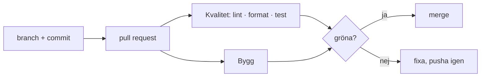

# CI-pipeline

## Flöde

## Vad stegen fångar

- **Lint:** hittar kodfel och problem med kodregler, till exempel oanvända variabler.
- **Format check:** kontrollerar att koden följer projektets Prettier-format.
- **Test:** kör Vitest och kontrollerar att testerna passerar.
- **Build:** kontrollerar att Vue-klienten kan byggas för produktion utan byggfel.

## Uppmätta tider

Tider från en grön körning i GitHub Actions:

| Steg | Tid |
| --- | ---: |
| npm ci (Kvalitet) | 8 s |
| Lint | 1 s |
| Format check | 1 s |
| Test | 2 s |
| npm ci (Bygg) | 10 s |
| Build | 2 s |
| Upload client dist | 2 s |
| Kvalitet totalt | 19 s |
| Bygg totalt | 25 s |

Det längsta enskilda steget var `npm ci` i Bygg-jobbet med 10 sekunder.
