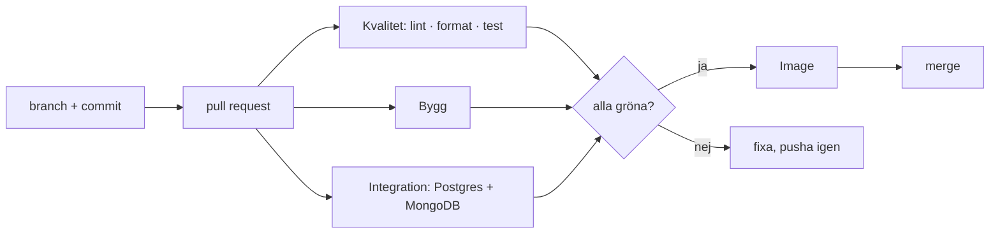

# CI-pipeline

## Flöde

```mermaid
flowchart LR
  B[branch + commit] --> PR[pull request]
  PR --> Q[Kvalitet: lint · format · test]
  PR --> BU[Bygg]
  PR --> I[Integration: Postgres + MongoDB]
  Q --> S{alla gröna?}
  BU --> S
  I --> S
  S -->|ja| IM[Image]
  IM --> M[merge]
  S -->|nej| F[fixa, pusha igen]
```

## Vad stegen fångar

- **Lint:** hittar kodfel och problem med kodregler, till exempel oanvända variabler.
- **Format check:** kontrollerar att koden följer projektets Prettier-format.
- **Test:** kör Vitest och kontrollerar att testerna passerar.
- **Build:** kontrollerar att Vue-klienten kan byggas för produktion utan byggfel.
- **Integration:** startar riktiga PostgreSQL- och MongoDB-tjänster, seedar databaserna, migrerar turloggarna och kör API-testerna mot båda databaserna.

## Integration

Integration-jobbet körs både för pull requests mot `main` och för pushes till `main`. GitHub Actions startar följande tjänster:

| Tjänst     | Image         | Port på runner |
| ---------- | ------------- | -------------: |
| PostgreSQL | `postgres:16` |         `5432` |
| MongoDB    | `mongo:8.2`   |        `27017` |

Jobbet väntar på att båda tjänsternas health checks är gröna. Det använder testdatabaserna `utpost` med användaren `utpost` och kör sedan:

1. `npm ci`
2. `npm run seed`
3. `npm run migrate:logs`
4. `npm run test:api`

`migrate:logs` kopierar turerna och deras loggpunkter från PostgreSQL till MongoDB. Den är idempotent och verifierar att antalet turer och loggpunkter matchar PostgreSQL innan jobbet fortsätter.

`test:api` innehåller regressionstestet för N+1 (`begränsar antalet databasfrågor med DataLoader`). Det läser `extensions.databasfragor` och gör jobbet rött om turlistan kostar fler än 4 databasfrågor.

### Uppmätt tid för Integration

Tider från GitHub Actions 2026-10-27, jobbets totala tid:

| Körning | Integration | Länk |
| --- | ---: | --- |
| Pull request (`ci/integration-databases`) | 55 s | [körning 40554449564](https://github.com/1sa1asdev/Hasta-la-vue-lta/actions/runs/40554449564/job/122366623610) |
| Push till `main` (merge av #102) | 50 s | [körning 40557378215](https://github.com/1sa1asdev/Hasta-la-vue-lta/actions/runs/40557378215/job/122376943713) |

På samma körning på `main` var alla fyra jobben gröna: Kvalitet 36 s, Bygg 17 s, Integration 50 s och Image 60 s.

## Nödvändiga checks

Branch protection för `main` kräver att följande checks är gröna innan en pull request kan mergas:

- **Kvalitet**
- **Bygg**
- **Integration**
- **Image**

`Image` väntar på att Kvalitet, Bygg och Integration har lyckats. På pull requests byggs images utan att publiceras. På pushes till `main` publiceras de till GHCR.

## Uppmätta tider

Tider från en tidigare grön GitHub Actions-körning, innan Integration-jobbet fanns, där Bygg-jobbet tog totalt 25 s och Kvalitet-jobbet 19 s:

| Steg               |  Tid |
| ------------------ | ---: |
| npm ci (Kvalitet)  |  8 s |
| Lint               |  1 s |
| Format check       |  1 s |
| Test               |  2 s |
| npm ci (Bygg)      | 10 s |
| Build              |  2 s |
| Upload client dist |  2 s |
| Kvalitet totalt    | 19 s |
| Bygg totalt        | 25 s |

Det längsta enskilda steget var `npm ci` i Bygg-jobbet med 10 sekunder.

## Docker images och publicering

Image-jobbet körs efter att Kvalitet, Bygg och Integration har lyckats. Det bygger Docker-images för API:t (`api/Dockerfile`) och klienten (`client/Dockerfile`).

- **Pull request:** Båda images byggs för att verifiera att Docker-byggena fungerar. De publiceras inte till GitHub Container Registry (GHCR).
- **Push till `main`:** Båda images publiceras till GHCR.
- **Taggar:** Images taggas med `sha-` följt av en kort commit-SHA, till exempel `sha-a1b2c3d`.
- **Behörigheter:** Endast Image-jobbet får `packages: write`, vilket begränsar publiceringsbehörigheten till det jobb som behöver den.

Images publiceras som:

- `ghcr.io/1sa1asdev/hasta-la-vue-lta-api`
- `ghcr.io/1sa1asdev/hasta-la-vue-lta-client`
